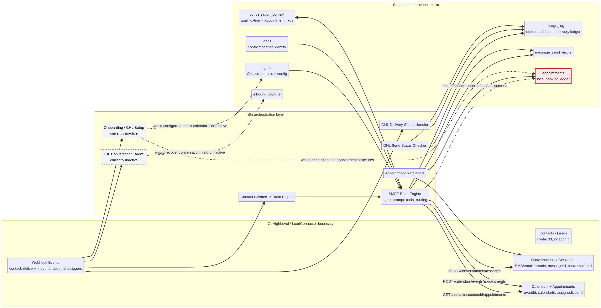

# SMRT GoHighLevel Boundary and Handoff Plan

**Author:** Manus AI  
**Date:** 2026-04-29  
**Status:** Read-only architecture and handoff document; no production changes made.  
**Related artifacts:** [`ghl_boundary_map.md`](./ghl_boundary_map.md), [`ghl_boundary_flow.png`](./ghl_boundary_flow.png), [`SMRT_SCHEMA_WORKFLOW_AUDIT.md`](./SMRT_SCHEMA_WORKFLOW_AUDIT.md), [`book_appointment_node_full.md`](./book_appointment_node_full.md)

## Executive conclusion

The next piece of the puzzle is not simply “GoHighLevel versus Supabase.” The actual boundary is a **three-ledger system**: GoHighLevel is the external CRM/communications/calendar system, n8n is the workflow orchestrator and decision layer, and Supabase is intended to be the operational mirror that NA / the Brain Engine can query reliably. HighLevel’s own documentation describes contacts, conversations, calendar/events, opportunities, and webhooks as first-class API surfaces, including calendar appointment workflows and real-time webhook callbacks.[1] In the exported SMRT workflows, those same surfaces appear repeatedly: 15 of 21 workflows contain GHL references, with 133 GHL-relevant nodes, including 48 outbound API exits, 13 webhook-style entries, and 11 GHL reads.[3]

The practical conclusion is that **GHL is currently acting as a system of record for CRM objects, message delivery, conversations, and appointment events**, while **Supabase is only partially acting as a system-of-work mirror**. That partial mirror is the source of the current confusion. Supabase has tables that imply durable state tracking, such as `appointments`, `message_log`, `conversation_context`, `leads`, and `inbound_capture`, but the workflows do not consistently guarantee that every important GHL event is mirrored locally. This matters because the Brain Engine can only reason over what it can retrieve from the workflow context, Supabase, or explicit GHL reads.

## Boundary model

The clean mental model is to treat GHL as the **external execution platform** and Supabase as the **internal operating ledger**. n8n stands in the middle, translating events and tool calls between those two worlds. When a lead sends a message, books an appointment, receives a reminder, or triggers a delivery event, the system needs to decide whether that event should remain only in GHL or also become durable Supabase state.

| Zone | What it appears to own today | What SMRT needs it to own intentionally | Current risk |
| --- | --- | --- | --- |
| **GoHighLevel / LeadConnector** | Contacts, conversations, outbound messages, delivery events, calendar appointment records, location and user IDs. | External CRM and communication execution. It should remain the source for GHL-native records, but not the only place where automation-critical state lives. | If SMRT does not mirror critical events, the Brain Engine can behave as if the event did not happen. |
| **n8n workflows** | Event intake, prompt assembly, tool execution, GHL API calls, Supabase inserts/updates, delivery/error handling. | Boundary enforcement. Every GHL entry and exit should have an explicit persistence, retry, and observability decision. | Current workflow logic includes best-effort side effects and inactive recovery paths, which creates hidden failure modes. |
| **Supabase** | Agent config, lead identity, message logs, conversation context, inbound captures, appointment table, errors. | Internal system-of-work ledger used for visibility, QA, orchestration, analytics, reminders, and future product surfaces. | Tables exist, but some are not reliably populated; the `appointments` ledger is the clearest example. |

## What the workflow evidence says

The GHL boundary extractor found a large integration surface rather than a single GHL adapter. The Brain Engine is the dominant integration point, but not the only one. Active workflows also include contact-created routing, delivery status handling, send-status checking, appointment reminders, document ingestion, newsletter dispatch, and data/newsletter creation.[3]

| Workflow | Active | Boundary interpretation | Supabase surfaces near GHL logic | Ownership implication |
| --- | --- | --- | --- | --- |
| **SMRT Brain Engine** | Yes | Primary orchestration layer. Sends messages, reads contact appointments, creates appointments, updates conversation context, and writes some logs/errors. | `agents`, `leads`, `conversation_context`, `message_log`, `message_send_errors`, `appointments`, `inbound_capture` | This is the highest-risk place to refactor directly. We should wrap and instrument before changing behavior. |
| **Contact Created -> Brain Engine** | Yes | GHL/contact entry path into the Brain Engine. It likely converts a GHL contact event into local lead context. | `leads` | Good candidate for developer handoff if the task is strictly mapping payload fields and idempotent lead upsert behavior. |
| **GHL Delivery Status Handler** | Yes | Delivery callback/handler surface for GHL message status. | `message_log`, `message_send_errors` | Should be preserved; likely needs standardization, not wholesale rebuild. |
| **GHL Send Status Checker** | Yes | Read/check path for message send state. | `message_log`, `message_send_errors` | Useful recovery pattern; similar approach may be needed for appointments. |
| **Appointment Reminders** | Yes | Reads local `appointments`, sends reminder SMS through GHL, logs reminder messages. | `appointments`, `leads`, `message_log` | This workflow assumes `appointments` is reliable. Right now that assumption is unsafe. |
| **GHL Conversation Backfill** | No | Inactive recovery path for historical conversation import. | `inbound_capture` | This should not be ignored. It may become the reconciliation model for missing inbound/message history. |
| **Onboarding — GHL Setup** | No | Inactive setup path for calendar/location/user configuration and rules. | `agents`, `agent_rules`, `appointments`, `leads`, `onboarding_requests` | Important for provisioning; likely explains some half-baked schema/workflow drift. |

## Entry and exit points

The GHL boundary is visible in four directional categories. The current architecture should be documented and improved around those categories rather than around isolated workflow names.

| Direction | Observed count | Meaning | Examples from SMRT evidence | Required policy |
| --- | ---: | --- | --- | --- |
| **Entry from GHL or external webhook** | 13 | GHL or an external trigger starts a workflow. | Contact-created flow, delivery status handler, document ingestion, onboarding webhooks. | Every entry should capture raw payload, normalized identity, processing result, and retry/error state. |
| **Exit to GHL API** | 48 | n8n sends or mutates data in GHL. | `POST /conversations/messages`, appointment creation, contact updates, notes, pipeline/calendar calls. | Every exit should have request intent, response ID, success/failure state, and local correlation key. |
| **Read from GHL API** | 11 | n8n queries GHL for state. | `GET /contacts/:contactId/appointments`, conversation/status checks, setup reads. | Reads should be used for reconciliation and fallback, not as an invisible substitute for local state. |
| **GHL reference or transform** | 61 | Workflow code manipulates GHL identifiers or GHL-related payload fields. | `contactId`, `locationId`, `calendarId`, `ghlUserId`, `messageId`, `conversationId`. | Identifier mapping should be centralized and validated. |

## What likely lives in GoHighLevel versus Supabase

HighLevel’s API documentation states that the platform exposes REST coverage for CRM contacts, conversations, calendar/events, opportunities, and webhooks.[1] The SMRT workflows align with that model. In practical terms, GHL should be assumed to contain the primary external records for contact identity, conversations, SMS/email delivery, calendar events, user/location context, and appointment objects.

Supabase, however, should contain the records needed for **internal reasoning and operational control**. The Brain Engine should not have to infer whether a booking exists by reading a chat transcript or hoping a best-effort insert succeeded. If the business cares about the event, a local row should exist with the GHL ID attached.

| Business object | Likely GHL object of record | Current Supabase mirror | Current confidence | Gap |
| --- | --- | --- | --- | --- |
| Lead/contact identity | GHL Contact, keyed by `contactId` and `locationId`. | `leads` plus GHL IDs inside prompt assembly and workflow payloads. | Medium | Need formal identity contract: which field is canonical, what happens if phone/email differs, and how contact merges are handled. |
| Conversation thread | GHL conversations/messages. | `message_log`, `conversation_context`, `inbound_capture`. | Medium-low | Outbound logging exists, but inbound capture/backfill appears partial and at least one backfill workflow is inactive. |
| Outbound SMS/email | GHL conversations/messages endpoint. | `message_log`, `message_send_errors`. | Medium | Delivery status is better instrumented than appointments, but should still be standardized. |
| Appointment booking | GHL Calendar Appointment event. | `appointments`, `conversation_context.appointment_booked`, reminder logic. | Low | Booking succeeds in GHL first, then local insert is best-effort and silent. This is the main visible failure. |
| Agent/location/calendar config | GHL location, calendar, user, possibly snapshot/setup objects. | `agents`, `agent_rules`, `onboarding_requests`. | Medium-low | Onboarding setup workflows are inactive; config may be manually or partially populated. |
| Opportunities/pipeline | GHL opportunities/pipelines. | Some nearby `leads` and onboarding references. | Low | Not enough evidence that pipeline state is consistently mirrored locally. |

## Appointment-specific boundary finding

The appointment issue is the cleanest place to start because it is narrow, user-visible, and already backed by evidence. The Brain Engine’s `bookAppointment` tool posts to `https://services.leadconnectorhq.com/calendars/events/appointments` and only after receiving a GHL response attempts to insert a local row into `appointments`.[5] The local insert uses `agent_id`, `lead_id`, `contact_id`, `location_id`, `ghl_event_id`, `calendar_id`, `start_time`, `end_time`, `duration_minutes`, `appointment_type`, `status`, and `booked_via`.[5] If that insert fails, the workflow catches the Supabase error and discards it with the comment that the “Supabase write is best-effort.”[5]

This explains how two booked appointments can exist from the user’s perspective while the `appointments` table remains empty. The HighLevel documentation also confirms there is a supported read surface for retrieving contact appointments through `GET https://services.leadconnectorhq.com/contacts/:contactId/appointments`, requiring `contacts.readonly` scope and returning events for a contact.[2] Therefore, SMRT has both a write path and a read/reconciliation path available, but it does not yet appear to have a guaranteed local ledger path.

| Step | Current behavior | Failure mode | Recommended policy |
| --- | --- | --- | --- |
| Agent decides to book | Brain Engine calls `bookAppointment`. | Decision may be logged only indirectly in `conversation_context`. | Persist booking intent before external call. |
| GHL event creation | Workflow posts to GHL calendar appointment endpoint. | GHL success does not guarantee Supabase success. | Store full GHL response and correlation ID. |
| Supabase insert | Workflow attempts local `appointments` insert after GHL success. | Any insert error is swallowed; no retry or alert. | Local insert failure must create an explicit `system_errors` or appointment sync error row. |
| Reminder workflow | Appointment reminders read local `appointments`. | Empty table means no reminders, no visibility, no internal booking ledger. | Reminders should only trust reconciled local appointment rows. |
| Customer asks about appointment | Brain Engine can use GHL `getAppointments`. | The answer may depend on live GHL reads instead of durable local context. | Use GHL read as reconciliation/fallback and write the result locally. |

## Risk map

The current system should not be treated as broken everywhere. It is better understood as **unevenly mirrored**. Some surfaces already show the right pattern, particularly delivery status and message error tracking. The risk is highest where the workflow mutates GHL and then silently treats Supabase persistence as optional.

| Risk | Severity | Why it matters | First diagnostic | Recommended owner |
| --- | --- | --- | --- | --- |
| **Silent appointment mirror failure** | Critical | Bookings can exist in GHL but not in Supabase, causing dashboards, reminders, analytics, and Brain context to disagree. | Reproduce one booking in a test contact and inspect GHL response, Supabase insert response, and error handling. | We define the contract; developer can implement once contract is frozen. |
| **Unclear GHL identity contract** | High | `contactId`, `locationId`, `lead_id`, `agent_id`, phone, and email can drift unless one mapping is canonical. | Trace one contact-created event from webhook payload to `leads` and Brain prompt context. | Joint: we audit and specify; developer patches mapping. |
| **Inactive onboarding setup workflows** | High | Calendar IDs, user IDs, rules, and agent config may be manually populated or stale. | Compare active `agents` rows against expected GHL `calendar_id`, `ghl_user_id`, and location values. | Developer if GHL account/API access is needed; we provide checklist. |
| **Partial inbound conversation mirror** | Medium-high | AI context may miss inbound content, and replay/backfill paths are inactive. | Inspect inbound webhook payload handling and compare to `message_log` / `inbound_capture`. | We can audit; developer should implement if workflow changes are needed. |
| **Distributed GHL calls across many nodes** | Medium | No single adapter means every tool can implement auth, version headers, error handling, and persistence differently. | Inventory repeated endpoint patterns and compare error behavior. | We should design; developer can refactor incrementally. |
| **Local state tables imply reliability they do not yet have** | Medium | The table set gives the impression of a complete system model, but some tables are staging or aspirational. | Mark each table as source-of-record, mirror, derived, staging, or deprecated. | We should own documentation and triage. |

## Recommended operating model for us versus the developer

We should not hand the whole rats nest back as a vague “fix the integration” request. That would almost certainly cause broad changes in the Brain Engine and make the system harder to reason about. The safer operating model is: **we own the map and contracts; the developer owns bounded implementation tickets; every implementation ticket includes acceptance evidence.**

| Work type | Best owner | Why | Acceptance evidence |
| --- | --- | --- | --- |
| System map, schema/workflow contract, triage order | Us | This requires architectural judgment and preventing scope creep. | Updated docs, diagrams, and ranked backlog. |
| Read-only audits and reconciliation queries | Us | We can do these safely without modifying production. | SQL outputs, artifact files, gap register. |
| n8n workflow edits that change GHL behavior | Developer, after handoff | Production workflow changes need careful deployment discipline and likely existing context from prior Claude work. | Before/after workflow export, test execution logs, error handling evidence. |
| Appointment ledger hardening | Joint | We define exactly what must be persisted and why; developer wires the workflow changes. | A booked test appointment appears in GHL and `appointments`; failed local insert creates an error row. |
| GHL API/account configuration validation | Developer or user-assisted | May require GHL UI/API access, private integration token scopes, and account-specific knowledge. | Confirmed scopes, calendar IDs, location IDs, user IDs, webhook subscriptions. |
| Documentation and change log | Us | This is how we avoid rediscovering the system each time. | Repo docs and `CHANGELOG.md` updated after each intervention. |

## Developer handoff packet 1: Appointment ledger hardening

This is the first handoff I would create if we decide to use your developer. It is bounded, testable, and addresses the current user-visible problem without asking him to refactor the entire Brain Engine.

| Field | Handoff detail |
| --- | --- |
| **Problem statement** | GHL appointments can be created successfully while the local Supabase `appointments` table remains empty because the Brain Engine’s local insert is best-effort and silently catches Supabase errors. |
| **Primary workflow** | `🧠 SMRT Brain Engine`, node `bookAppointment`. |
| **Relevant current behavior** | Posts to GHL `calendars/events/appointments`, then attempts POST to Supabase `/rest/v1/appointments`; local write failure is swallowed. |
| **Required change** | Make appointment persistence observable and idempotent. Do not let a local mirror failure disappear. |
| **Do not change yet** | Agent conversation strategy, qualification logic, prompt behavior, broad tool routing, or reminder cadence. |
| **Acceptance test 1** | Book a test appointment through the same path used by production. Confirm the GHL event ID is present in GHL and `appointments.ghl_event_id`. |
| **Acceptance test 2** | Force or simulate a Supabase insert failure. Confirm the workflow writes a durable error record with `contact_id`, `location_id`, attempted slot, GHL event ID if available, and failure reason. |
| **Acceptance test 3** | Run the appointment reminder workflow against the test row and confirm it can read the appointment row without relying on GHL live reads. |
| **Rollback expectation** | If persistence hardening fails, GHL booking behavior should remain unchanged; the patch should only add observability and reliable local mirroring. |

## Developer handoff packet 2: GHL identity contract audit

This is the second handoff, but I would not do it before the appointment ledger. Identity touches more workflows and is easier to over-expand.

| Field | Handoff detail |
| --- | --- |
| **Problem statement** | The system uses GHL identifiers (`contactId`, `locationId`, `calendarId`, `ghlUserId`) and Supabase identifiers (`lead_id`, `agent_id`) across multiple workflows, but there is not yet a single visible identity contract. |
| **Primary workflows** | `Contact Created -> Brain Engine`, `SMRT Brain Engine`, `Onboarding — Part 1`, `Onboarding — Part 2`. |
| **Required change** | Produce or implement a canonical mapping: GHL contact to Supabase lead, GHL location to Supabase agent/location context, GHL calendar/user to booking context. |
| **Acceptance test 1** | Given a GHL contact-created webhook payload, the exact Supabase lead row and Brain prompt fields are deterministic. |
| **Acceptance test 2** | Given an existing Supabase lead, the system can retrieve or infer the correct GHL `contactId` and `locationId`. |
| **Acceptance test 3** | Missing or conflicting IDs create an explicit error/triage record rather than silently falling back to empty strings. |

## Developer handoff packet 3: GHL conversation and inbound mirror

This should wait until after appointment visibility and identity mapping. It is important, but it is broader.

| Field | Handoff detail |
| --- | --- |
| **Problem statement** | Conversations and inbound messages appear distributed across `message_log`, `inbound_capture`, `conversation_context`, and inactive backfill/replay workflows. |
| **Primary workflows** | `GHL Delivery Status Handler`, `GHL Send Status Checker`, `GHL Conversation Backfill`, `Inbound Replay`, `SMRT Brain Engine`. |
| **Required change** | Decide whether `message_log` is the canonical local message ledger, then route inbound, outbound, delivery, and backfill events consistently. |
| **Acceptance test 1** | A new inbound GHL message creates or updates exactly one canonical local message record. |
| **Acceptance test 2** | An outbound Brain Engine SMS has local accepted/sent/failed status and GHL `messageId`/`conversationId` where available. |
| **Acceptance test 3** | Backfill can import missing GHL conversation history without duplicating messages. |

## Recommended next move

The next move should be **not** to ask the developer to “fix GHL.” The next move should be to create a single bounded ticket: **Appointment Ledger Hardening v1**. We should include the exact node evidence, acceptance tests, and rollback expectations above. That gives your developer and Claude a precise task, while we keep the architectural map and prevent a broad refactor.

After that ticket, we should run a short verification audit. If the appointment ledger becomes reliable, we move to the identity contract. If it does not, we pause and inspect whether the issue is credentials, table constraints, field names, RLS/service key behavior, or GHL response shape.

## References

[1]: https://marketplace.gohighlevel.com/docs/ "HighLevel API Documentation"
[2]: https://marketplace.gohighlevel.com/docs/ghl/contacts/get-appointments-for-contact/ "Get Appointments for Contact | HighLevel API"
[3]: ./ghl_boundary_map.md "SMRT GoHighLevel Boundary Map"
[4]: ./SMRT_SCHEMA_WORKFLOW_AUDIT.md "SMRT Schema-Workflow Audit"
[5]: ./book_appointment_node_full.md "SMRT Brain Engine bookAppointment Node Evidence"
