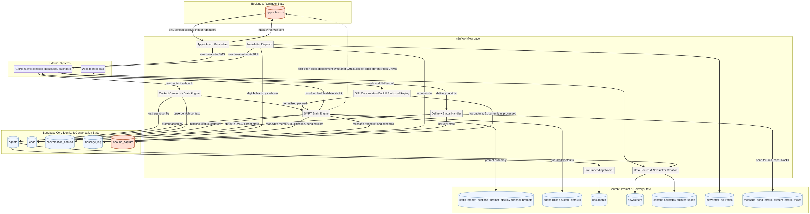

# SMRT Schema-Workflow Audit and Hardening Plan

**Author:** Manus AI  
**Date:** 2026-04-29  
**Scope:** Read-only audit of the SMRT Supabase schema, live row-health signals, and exported n8n workflow structure.

## Executive Summary

This audit shows that SMRT already has most of the primitives required for a traceable conversation-and-booking system, but the current operating model is split across **GoHighLevel as the action system**, **n8n as the orchestration layer**, and **Supabase as the intended canonical memory and observability layer**. The major risk is not the absence of tables. The major risk is that several critical state transitions are implemented as **best-effort side effects** instead of durable, auditable first-class events.

The strongest example is appointments. The `appointments` table exists, has the fields needed to track GHL event IDs, contact IDs, start/end times, statuses, and reminder flags, and is referenced by both the SMRT Brain Engine and Appointment Reminders workflows.[1] [2] However, the live audit found **0 rows in `appointments`**, even though recent message history contains repeated appointment language such as “Can you get me on the calendar with Luke?”, “Still having trouble with the calendar,” “the booking did not go through,” and “we are already set up for a meeting.”[3] This means appointment visibility is currently being lost at exactly the point where SMRT needs a reliable operational ledger.

> **Working model:** Treat Supabase as the system of record for local observability, memory, reminders, and auditability, while treating GoHighLevel as the external execution system for contacts, messages, and calendar events. A booking should not be considered operationally complete until it has both a confirmed GHL result and a durable Supabase appointment or booking-attempt record.

The immediate recommendation is to avoid trying to fix everything at once. The first hardening sprint should be a narrow appointment-ledger sprint: make booking attempts visible, stop swallowing local persistence failures silently, and add a reconciliation path from GHL calendar events back into `appointments`. Only after appointment visibility is stable should the team move to inbound replay hygiene, conversation state consolidation, and prompt/config cleanup.

## Working System Diagram

The following diagram is the durable navigation map for the current SMRT operating model. It highlights the two most urgent gap points: `appointments`, which currently has no rows despite appointment-language activity, and `inbound_capture`, which has unprocessed inbound records.

## Evidence Base

The audit combined schema metadata, workflow JSON extraction, and read-only live row-health queries. The workflow scan covered **21 workflows** and found **199 workflow nodes** with database or schema-relevant references. Of the **33 public schema relations** inventoried, **23 were directly referenced by workflow exports** and **10 were not directly observed in workflow references**.[2]

| Evidence Artifact | What It Proves | Path |
| --- | --- | --- |
| Supabase schema inventory | All public tables/views, columns, primary keys, foreign keys, and indexed surfaces identified during the read-only metadata audit. | `docs/system/supabase_schema_inventory.md` |
| Workflow-schema relationship map | Which exported n8n workflows reference which Supabase tables and which operation signals appear in nodes. | `docs/system/workflow_schema_relationship_map.md` |
| Live gap audit findings | Row counts, appointment health, orphan summaries, agent state, and appointment-language evidence from live read-only queries. | `docs/system/supabase_gap_audit_findings.md` |
| Appointment workflow path | Focused extraction of appointment-related n8n nodes and connections from the raw workflow export. | `docs/system/appointment_workflow_path.md` |
| Full booking node evidence | Exact `bookAppointment` tool implementation, including GHL booking call and best-effort Supabase insert. | `docs/system/book_appointment_node_full.md` |
| System diagram source and render | Durable system map in Mermaid and PNG form. | `docs/system/smrt_system_flow.mmd`, `docs/system/smrt_system_flow.png` |

## Schema Model: What Supabase Is Trying to Represent

The live schema is not random; it is a partially complete operating model. The `agents` table is the tenant/config anchor. The `leads` table is the canonical local contact record keyed by `contact_id` and `location_id`. The `conversation_context` table is the rolling memory and intent state layer. The `message_log` table is the transcript and send-status trail. The `appointments` table is intended to be the local booking/reminder ledger. Content and nurture are represented by `newsletters`, `content_splinters`, `newsletter_deliveries`, `documents`, and prompt/config tables.[1]

| Domain | Canonical Tables | Current Reading |
| --- | --- | --- |
| Tenant and agent configuration | `agents`, `agent_rules`, `system_defaults`, `static_prompt_sections`, `prompt_blocks`, `channel_prompts` | The system has a single active agent. Calendar and GHL user configuration are present, while custom personality prompt is not enabled.[3] |
| Contact identity and lifecycle | `leads`, `contact_intake_queue`, `pipeline_transitions`, `dormancy_events` | `leads` is active and well-connected. Several secondary lifecycle tables are either not observed in workflow exports or not central to the current production path.[2] |
| Conversation memory and transcript | `conversation_context`, `message_log`, `inbound_capture` | Memory and logs exist and have referential links to leads/agents. `inbound_capture` has a backlog of unprocessed records that should be triaged before deeper routing edits.[3] |
| Booking and reminders | `appointments` | The schema exists, but the table currently has zero rows. Reminders depend on this table, so missing rows mean reminders and appointment visibility cannot work locally.[3] |
| Delivery and error visibility | `message_send_errors`, `system_errors`, `ai_output_errors`, delivery views | Error tables exist, but booking-local-write failures are currently swallowed inside the workflow and do not appear to have a durable failure channel.[4] |
| Content and nurture | `newsletters`, `content_splinters`, `splinter_usage`, `newsletter_deliveries`, `documents`, `altos_weekly_stats` | Newsletter and market-content pathways are significantly more developed than the appointment ledger pathway.[2] |

## Workflow Model: How Information Is Processed

The current workflow architecture concentrates most real-time intelligence in **SMRT Brain Engine**, which has 174 nodes and 70 database-relevant nodes in the static scan. The Brain Engine reads agent configuration, prompt blocks, static prompt sections, system defaults, documents, lead state, message history, and conversation context; it writes message logs, lead updates, conversation context updates, errors, inbound capture references, and appointment-related side effects.[2]

| Workflow | Active | Main Role | Database Surfaces |
| --- | --- | --- | --- |
| `SMRT Brain Engine` | True | Main conversation, classification, response, memory, qualification, booking tools. | `agents`, `leads`, `conversation_context`, `message_log`, `appointments`, prompt/config tables, error tables. |
| `Contact Created -> Brain Engine` | True | New contact intake and handoff into conversation engine. | `agents`, `leads`, `contact_intake_queue`. |
| `Appointment Reminders` | True | Sends 24h, 5h, and 1h reminders from local appointment rows. | `appointments`, `leads`, `message_log`. |
| `GHL Delivery Status Handler` | True | Updates local message/delivery state from GHL receipts. | `message_log`, `message_send_errors`, `leads`. |
| `Newsletter Dispatch` | True | Sends newsletter content to eligible leads and records delivery. | `agents`, `leads`, `newsletter_deliveries`. |
| `Data Source & Newsletter Creation` | True | Creates market-content/newsletter assets and splinters. | `agents`, `newsletters`, `content_splinters`, `documents`, `altos_weekly_stats`. |
| `Inbound Replay` / `GHL Conversation Backfill` | False | Capture/replay/backfill inbound messages. | `inbound_capture`, `agents`. |

The shape of this architecture suggests an important design principle: **do not begin by rewriting the Brain Engine**. The Brain Engine is large, central, and intertwined with many side effects. The safer first move is to add observability and reconciliation around the narrow booking path, then use the resulting evidence to decide whether the Brain Engine itself needs structural surgery.

## Critical Finding 1: Appointments Are Not Locally Observable

The `appointments` table has the exact columns one would expect for a local booking ledger: `agent_id`, `lead_id`, `contact_id`, `ghl_event_id`, `calendar_id`, `start_time`, `end_time`, `duration_minutes`, `appointment_type`, `status`, `booked_via`, `conversation_summary`, `lead_intent`, `location_id`, and reminder timestamps.[1] The Appointment Reminders workflow queries this table and joins it to `leads` and `agents`; therefore, if the table is empty, the reminder system has nothing to operate on.[5]

The live gap audit found `appointments = 0`, while `leads = 313`, `message_log = 376`, `inbound_capture = 179`, and `conversation_context = 25`.[3] This does not prove that no meetings exist in GHL. It proves that the **local appointment ledger is empty**, which is enough to explain why booked appointments are not visible in the Supabase appointments table and why local reminders cannot be driven from confirmed bookings.

| Appointment Signal | Evidence | Interpretation |
| --- | --- | --- |
| Local appointment rows | `appointments = 0` | The local booking ledger is empty.[3] |
| Reminder dependency | Appointment Reminders queries `appointments` joined to `leads` and `agents` | Reminders cannot run for bookings missing from `appointments`.[5] |
| Conversation evidence | Messages mention calendar problems and suspected booked meetings | Users are experiencing appointment flow behavior that is not represented in the local ledger.[3] |
| Context evidence | `appointment_booked = true` contexts count is 0 | The Brain Engine is not consistently setting local memory flags for bookings either.[3] |
| Workflow write behavior | `bookAppointment` writes to GHL first, then tries a best-effort Supabase insert and swallows local errors | A GHL booking can succeed while the local ledger silently fails.[4] |

The most likely failure modes are straightforward. First, the GHL booking call may succeed but return an ID shape other than `data.id`, causing the local write block to be skipped. Second, `ctx.supabaseServiceKey` or `ctx.supabaseUrl` may be missing from the assembled context, causing the local write block to be skipped. Third, the REST insert may fail due to row-level security, a required-field mismatch, a conflict on `ghl_event_id`, or a schema/API mismatch, and the error is swallowed. Fourth, the AI may report that a booking was or will be handled without the tool completing a successful insert, because booking-attempt state is not durable.

> **Key diagnosis:** The appointment table is not merely missing data. The workflow has no durable booking-attempt ledger and no visible failure channel for local appointment persistence. That makes the system feel like a rats nest because the most important transition is hidden inside a swallowed side effect.

## Critical Finding 2: Inbound Capture Has a Backlog

The live audit found **31 unprocessed inbound_capture rows**.[3] This matters because `inbound_capture` appears to be the raw ingress/replay surface for GHL conversation events. If raw inbound records are not processed, the Brain Engine may have partial conversation visibility, and message direction can become suspect.

The message evidence includes a notable example where content that appears to be outbound was represented or interpreted as inbound, including an internal-style response about staying silent. That single sample should not be overgeneralized, but it does show why inbound replay hygiene matters before broad prompt or routing changes. If direction, source, and processed-state are inconsistent, downstream classification will look “wrong” even when the prompt is behaving as instructed.

| Inbound Issue | Evidence | Risk |
| --- | --- | --- |
| Unprocessed raw captures | 31 rows in `inbound_capture` remain unprocessed.[3] | Replays may be incomplete, duplicated, or blocked. |
| Direction ambiguity | Message excerpts include content that appears outbound but is treated as inbound.[3] | The Brain Engine can respond to the wrong side of the conversation. |
| Backfill workflows inactive | Inbound Replay and GHL Conversation Backfill are inactive in the workflow inventory.[2] | Recovery tooling exists but may not be part of the normal operating loop. |

## Critical Finding 3: Conversation State Is Split Across Several Places

SMRT currently stores conversation memory in at least three places: `conversation_context`, `leads`, and `message_log`. That is not automatically bad, but the boundaries need to be explicit. The `conversation_context` table stores rolling summaries, appointment flags, offered slots, pending slots, lead intent, timeline, qualifying answers, and newsletter state. The `leads` table stores contact lifecycle fields, pipeline stage, status, counters, opt-out state, and summary. The `message_log` table stores the atomic exchange trail.[1]

The gap is that appointment state exists in all three conceptual layers but is not consistently written to the dedicated appointment ledger. The result is a system where the conversation can talk about booking, the context can theoretically mark booking state, GHL can possibly hold an event, and Supabase can still show zero appointments. This is the core architectural mismatch to fix first.

| State Layer | Should Own | Should Not Own Alone |
| --- | --- | --- |
| `message_log` | Atomic historical messages, delivery IDs, send status, content excerpts, and audit trail. | Final booking truth. |
| `conversation_context` | Rolling memory, pending slots, qualifying answers, inferred lead state, appointment-offered/booked flags. | External calendar event truth. |
| `appointments` | Durable local representation of actual booking events and reminder state. | Prompt-only inference without a GHL event or reconciliation evidence. |
| GHL calendar | External calendar execution, availability, event creation, event updates. | Local reminders, auditability, and cross-table system visibility. |

## Gap Register

The table below ranks the current gaps by operational risk and by whether they should be addressed before broader workflow cleanup. The intent is to prevent over-fixing and keep the first sprint shippable.

| Rank | Gap | Evidence | Impact | Recommended First Move |
| ---: | --- | --- | --- | --- |
| 1 | Empty local appointment ledger despite appointment-language conversations | `appointments = 0`; booking-related messages present; `bookAppointment` local insert is best-effort and silent.[3] [4] | Bookings are not visible locally, reminders cannot run, and debugging requires conversation archaeology. | Add a durable booking-attempt and appointment-write result trail; make local write failures visible. |
| 2 | No GHL-to-Supabase appointment reconciliation | Appointment Reminders depend on local rows; no evidence of active calendar-event sync path.[2] [5] | A GHL event can exist without Supabase knowing. | Build a read-only reconciliation job that fetches upcoming GHL appointments and upserts local `appointments`. |
| 3 | Inbound replay/capture backlog | 31 unprocessed `inbound_capture` records.[3] | Brain Engine may be missing or misreading events. | Triage unprocessed capture rows and decide whether replay/backfill workflows should be activated or replaced. |
| 4 | Hidden local persistence failures | `bookAppointment` catches Supabase errors and discards them.[4] | Production failures become invisible and repeated. | Route booking-local-write errors to `system_errors` or `message_send_errors` with safe payloads. |
| 5 | Appointment state split across context, messages, GHL, and appointments | `appointment_booked` contexts are 0, while appointment-language messages exist.[3] | No single operational truth for “is this lead booked?” | Define appointment state ownership and update rules. |
| 6 | Some schema surfaces not observed in workflows | 10 relations not directly observed in workflow exports.[2] | Possible dead schema or unfinished features. | Defer until appointment and inbound health are stable; then classify as used, planned, or deprecated. |
| 7 | Agent personalization partially configured | Active agent has notes/calendar/GHL settings, but custom personality prompt is disabled and no personality prompt is present.[3] | Lower response quality, but not likely the root cause of missing appointments. | Defer until transaction-state bugs are solved. |

## Recommended Game Plan

The team should sequence work in small, observable moves. The first sprint should not attempt a full workflow refactor. It should make the booking path auditable end-to-end.

| Sprint | Objective | Acceptance Criteria |
| --- | --- | --- |
| Sprint 1: Appointment ledger visibility | Make every booking attempt observable whether it succeeds or fails. | A booking attempt creates either an `appointments` row or an explicit error/audit row with contact ID, location ID, attempted slot, GHL response shape, and local write result. |
| Sprint 2: GHL appointment reconciliation | Backfill and continuously reconcile GHL events into Supabase. | Upcoming GHL appointments for the active location appear in `appointments` with stable `ghl_event_id`; duplicate events are not created. |
| Sprint 3: Inbound capture hygiene | Clear and govern `inbound_capture` backlog. | Every raw inbound capture is either processed, intentionally ignored, or marked with a replay/error reason. |
| Sprint 4: State ownership contract | Define which table owns which fact. | A short schema contract states ownership for identity, transcript, rolling memory, booking truth, delivery truth, and content delivery. |
| Sprint 5: Workflow cleanup | Remove dead or half-baked surfaces only after observability exists. | Inactive/unreferenced workflows and tables are classified as active, deprecated, test-only, or backlog. |

## Proposed First Technical Change Set

The safest first change is not to alter user-facing booking behavior. The safest first change is to make the existing behavior impossible to hide. In the `bookAppointment` tool, the GHL POST should continue to run, but the workflow should capture the complete result shape, derive the event ID robustly, and record local persistence outcomes. If local persistence fails, it should write a sanitized error row rather than swallowing the exception.

| Change | Why It Matters | Risk |
| --- | --- | --- |
| Derive event ID from multiple likely response paths, not only `data.id`. | Prevents skipping local insert when GHL returns nested appointment/event data. | Low if implemented defensively. |
| Log local Supabase insert status. | Turns invisible failures into searchable evidence. | Low if payload is sanitized. |
| Add booking attempt audit rows or use `system_errors` for failed local writes. | Distinguishes GHL failure, local failure, and AI/tool invocation failure. | Medium if a new table is added; low if using existing error table first. |
| Reconcile from GHL calendar to `appointments`. | Covers historical and future cases where GHL succeeds but local write fails. | Medium because it touches GHL calendar API semantics. |
| Keep Appointment Reminders unchanged until rows are reliable. | Avoids debugging reminders before the source ledger exists. | Low. |

## Decisions to Make Before Editing Production

Before modifying production workflows, the team should decide whether to introduce a new `appointment_events` or `booking_attempts` table, or whether to use existing `system_errors` and `appointments` fields for the first sprint. A dedicated event table is cleaner long-term, but using existing error infrastructure is faster and safer for immediate visibility.

| Decision | Option A | Option B | Recommendation |
| --- | --- | --- | --- |
| Booking-attempt persistence | Add `booking_attempts` as a first-class ledger. | Use `system_errors` for failed writes and `appointments` for successful writes. | Start with Option B if speed matters; graduate to Option A once failure modes are understood. |
| GHL reconciliation | Scheduled workflow pulls upcoming events from GHL. | Manual/backfill-only reconciliation during audit. | Use scheduled reconciliation after a read-only dry run. |
| Appointment truth | GHL is truth, Supabase mirrors it. | Supabase is truth and pushes to GHL. | GHL should remain execution truth; Supabase should be observability/reminder truth. |
| Brain Engine refactor | Refactor now. | Add auditability first. | Add auditability first. |

## Durable Navigation Notes

When returning to this project later, start with the working diagram and then inspect the five evidence artifacts listed above. Do not begin by opening every workflow. The correct entry point is the narrow path of the problem being investigated: appointments start with `book_appointment_node_full.md`, reminders start with `appointment_workflow_path.md`, table structure starts with `supabase_schema_inventory.md`, and workflow/table mapping starts with `workflow_schema_relationship_map.md`.

The current invisible model is therefore:

| Question | First Artifact | Then Check |
| --- | --- | --- |
| “Why is a booking missing?” | `book_appointment_node_full.md` | GHL response shape, local insert result, `appointments.ghl_event_id`, `message_log` around contact/time. |
| “Why did no reminder send?” | `appointment_workflow_path.md` | Whether an `appointments` row exists with `status = scheduled` and reminder timestamps null. |
| “Why did the bot respond strangely?” | `supabase_gap_audit_findings.md` | `inbound_capture.processed`, message direction, context summary, recent `message_log`. |
| “Which workflow touches this table?” | `workflow_schema_relationship_map.md` | Node-level evidence and operation signal. |
| “What fields are safe to use?” | `supabase_schema_inventory.md` | Exact column names, nullability, defaults, keys, and indexes. |

## References

[1]: ./supabase_schema_inventory.md "SMRT Supabase Schema Inventory"  
[2]: ./workflow_schema_relationship_map.md "SMRT Workflow-Schema Relationship Map"  
[3]: ./supabase_gap_audit_findings.md "SMRT Supabase Gap Audit Findings"  
[4]: ./book_appointment_node_full.md "Full bookAppointment Node Evidence"  
[5]: ./appointment_workflow_path.md "Appointment Workflow Path Evidence"
